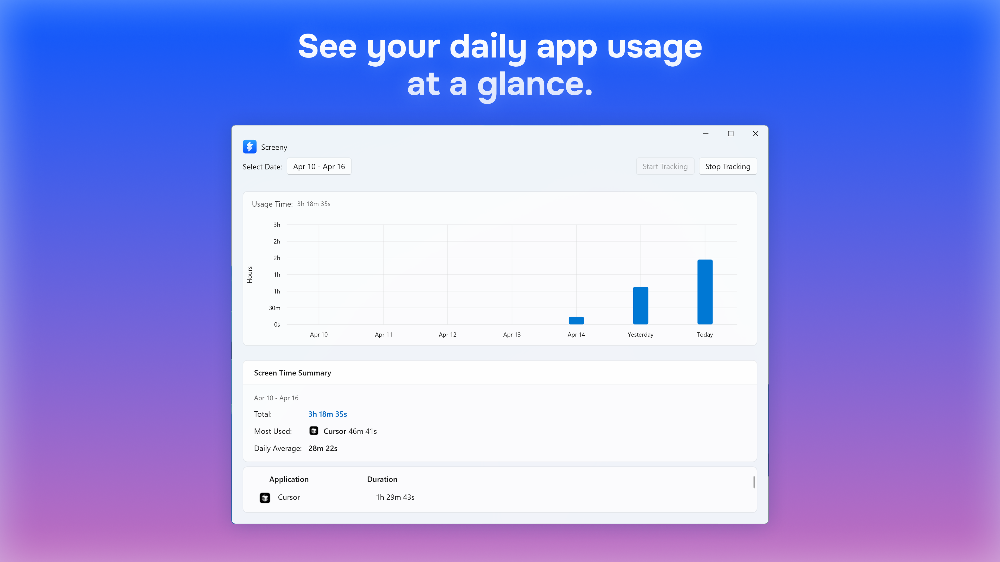

# Screeny

A privacy-focused screen time tracker for Windows, built with WinUI 3 and the Windows App SDK.



## About

Screeny is a lightweight desktop application that helps you monitor how much time you spend in different applications on your Windows computer. It runs silently in the background, tracking which applications are in focus and providing intuitive visualizations of your usage patterns.

### Key Features

- **Privacy First**: All data stays on your device - no internet connection required
- **Native Windows 11 Experience**: Built with WinUI 3 and the Windows App SDK
- **Minimal Resource Usage**: Designed for efficiency with minimal system impact
- **Detailed Analytics**: View your screen time by hour, day, week, or month
- **Modern UI**: Clean interface with system accent color support

## Installation

### Microsoft Store
*(https://apps.microsoft.com/detail/9P2XX9PJM3SR?hl=en-us&gl=US&ocid=pdpshare)*

## Usage

1. Launch the application
2. Screeny automatically starts tracking which applications are in focus
3. View your usage data in real-time in the main dashboard
4. Switch between hourly and daily views using the toggle buttons
5. Select different date ranges to view historical data

## Building from Source

### Prerequisites
- Windows 11
- [.NET SDK 8.0](https://dotnet.microsoft.com/download/dotnet/8.0) or newer
- [Windows App SDK](https://learn.microsoft.com/en-us/windows/apps/windows-app-sdk/set-up-your-development-environment)

### Build Steps
```
git clone https://github.com/ArnoGevorkyan/Screeny.git
cd Screeny
dotnet build
```

## Contributing

Contributions are welcome! Please feel free to submit a Pull Request.

## License

This project is licensed under the MIT License - see the [LICENSE](LICENSE.md) file for details.

## Privacy

Screeny is designed with privacy in mind. All tracking data is stored locally on your device and never transmitted over the internet. See the [PRIVACY](PRIVACY.md) file for our full privacy policy. 
